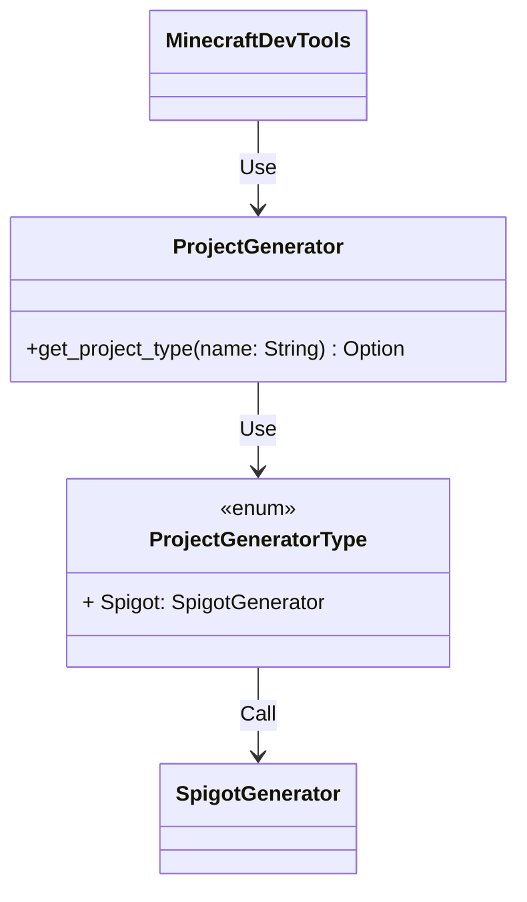

# Minecraft Dev Tools

The main goal for this tool is to provide a way to easily create template for Minecraft plugins, mods, etc...
Here are the diagrams that show how the tool operates:

## Global Architecture

